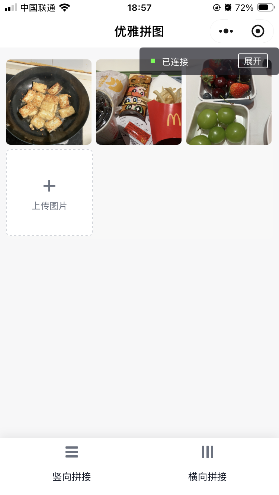

## 1. 产品介绍

这是一个 **微信小程序：图片拼接工具**，支持将多张图片按 **竖向/横向** 进行拼接并导出保存。

- **核心能力**：Canvas 2D 拼接、多图拖拽排序、多选删除、进度提示、不同平台（iOS/Android）兼容与稳定性优化
- **设计目标**：
    1. 页面简洁，交互友好；
    2. 在保证清晰度的同时，尽可能降低大图/多图带来的内存峰值，避免卡顿与闪退。

支持在微信小程序搜索 “优雅拼图”，即可体验。
页面预览：
[预览图（点击打开）](https://github.com/Iamctb/ImageStitching/blob/main/preview.PNG)



## 2. 操作说明

- **上传图片**：点击页面中的“上传图片”卡片选择图片（最多 9 张）
  - 选择完成返回页面后，会立即显示“准备图片”进度
  - 如遇到“缓存空间不足”，小程序会自动改为临时加载模式继续使用
- **调整顺序**：长按图片并拖拽可调整拼接顺序
- **多选删除**：长按任意图片进入多选模式，点选右上角圆形角标选择/取消选择，底部点击“删除所选图片”批量删除
- **拼接图片**：点击底部“竖向拼接 / 横向拼接”按钮开始拼图
  - 拼接过程中会显示进度条，并自动打开预览
  - 预览页面长按可保存到相册
- **温馨提示**：双击“温馨提示”区域可切换文字透明/恢复

## 3. 部署说明

### 本地运行（微信开发者工具）

1. 安装并打开 **微信开发者工具**
2. 下载本项目到本地
```
git clone https://github.com/Iamctb/ImageStitching.git
```
3. 选择 **导入项目**
   - 项目目录选择：`miniprogram-stitch/miniprogram`
4. AppID
   - 有 AppID：填写自己的小程序 AppID
   - 无 AppID：可选择“使用测试号”或不填（视开发者工具版本而定）
5. 点击运行即可预览


